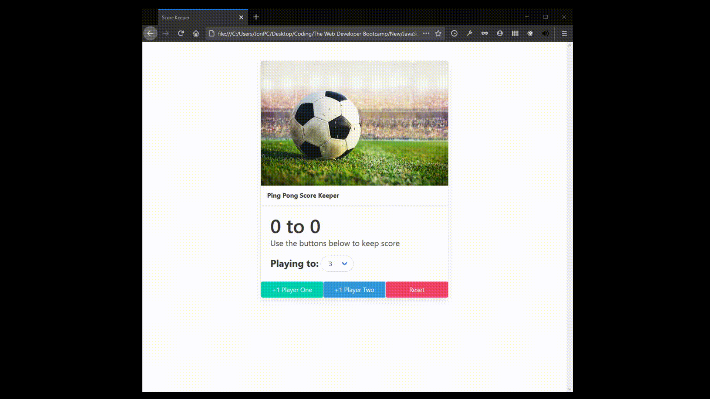

# Scorekeeper

Small project to demonstrate and practice dom manipulation. Nothing crazy

Menu that adds points to player's scores. There is a dropdown menu that allows to choose option score where game will end. Also has reset button where scores will reset back to 0.
